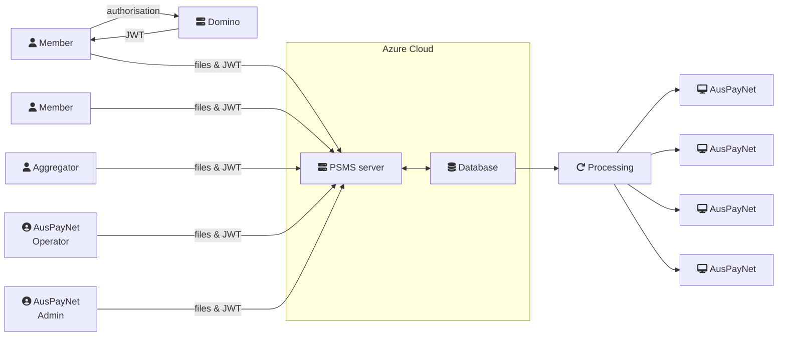

The major operation is the importing of files, and this is the public facing part of the system. A member may login (via Domino, which creates an authorisation "token") and access the site. They see only a small subset of the overall functionality. Operators and Administrators have more functionality available.

The file importation is a straightforward process, involving just drag and drop of one or many files. Each file is examined to determine:
* the type of file being submitted (by comparison against "reference files")
* the organisation to which it refers
* the period to which it applies

This is validated against the currently logged-in user. In general a member may only submit files for their own organisations, but there are some overarching organisations (referred to as "aggregators") who may submit data for a group of members.

Once validated, the data is extracted to a single database table (currently on an Azure database), where subsequent analysis may be done.

