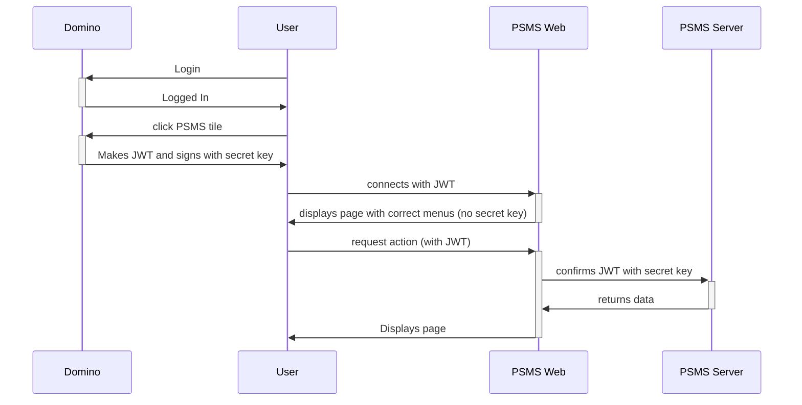

Security is maintained using a JWT - a JSON web Token - that is issued by the Domino server.

It contains user details, and is signed using a secret key held by the Domino server and the PSMS back end server.

The PSMS Web front end server can read the data (and thus display the correct menus), **but cannot confirm the signature as it does not posses the secret key**. Every request to the back end is accompanied by the original JWT (with the signature). The back end server can read the JWT data **and also confirm it is correctly signed using its copy of the secret key**.

The JWT also contains an expiry datestamp which may be read by the front end and the back end.

