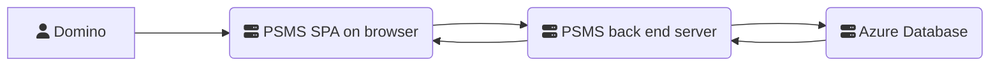

The PSMS system is comprised of the following components:

* Domino server - hosts the "tile" which constructs the JWT for authorisation
* SPA on Browser - Single Page Application (SPA) loaded from Azure using VueJS and BootstrapVue
* Back end server - running on Azure using NodeJs
* Database - running on Azure database (see Database documentation)
