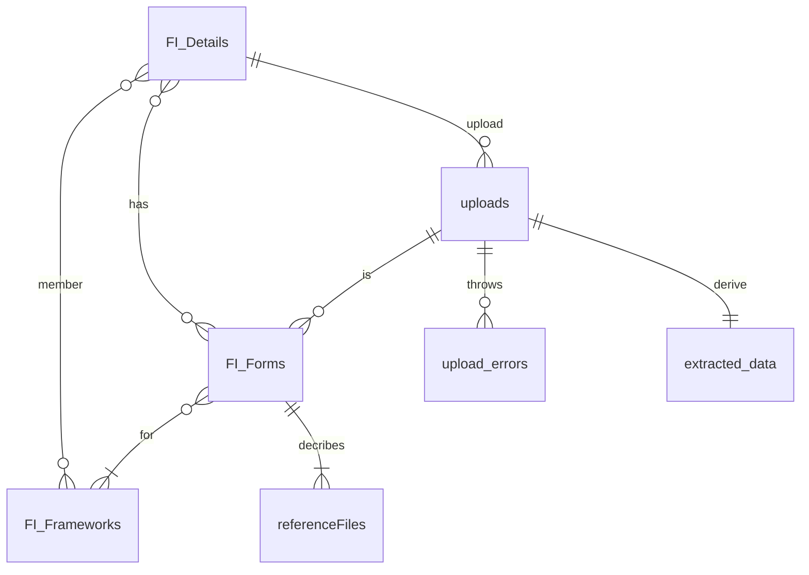

The PSMS database is an MS SQL database running on the Azure platform.
It generates indexes to improve performance automatically.

```mermaid
erDiagram
    FI_Details }o--o{ FI_Frameworks : member
    FI_Details }o--o{ FI_Forms : has
    FI_Forms }o--|{ FI_Frameworks : for
    FI_Forms ||--|{ referenceFiles : decribes

    FI_Details ||--o{ uploads : upload
    uploads ||--o{ FI_Forms : is
    uploads ||--o{ upload_errors : throws

    uploads ||--|| extracted_data : derive
```